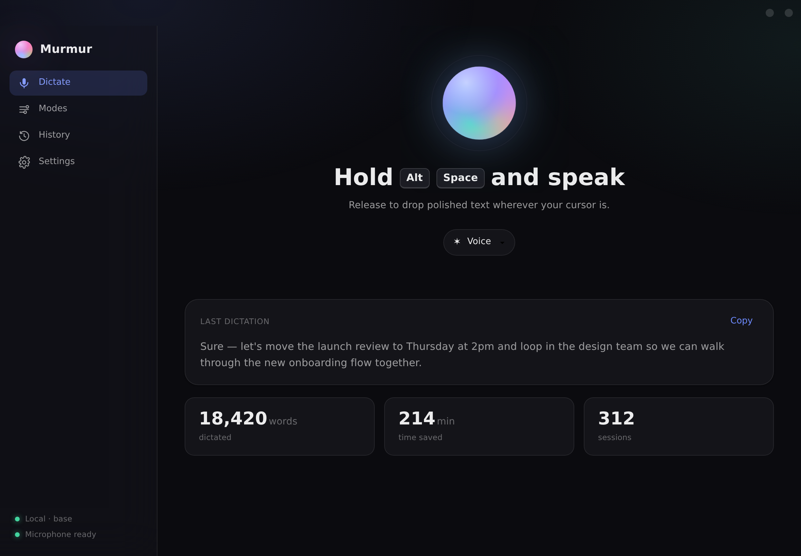
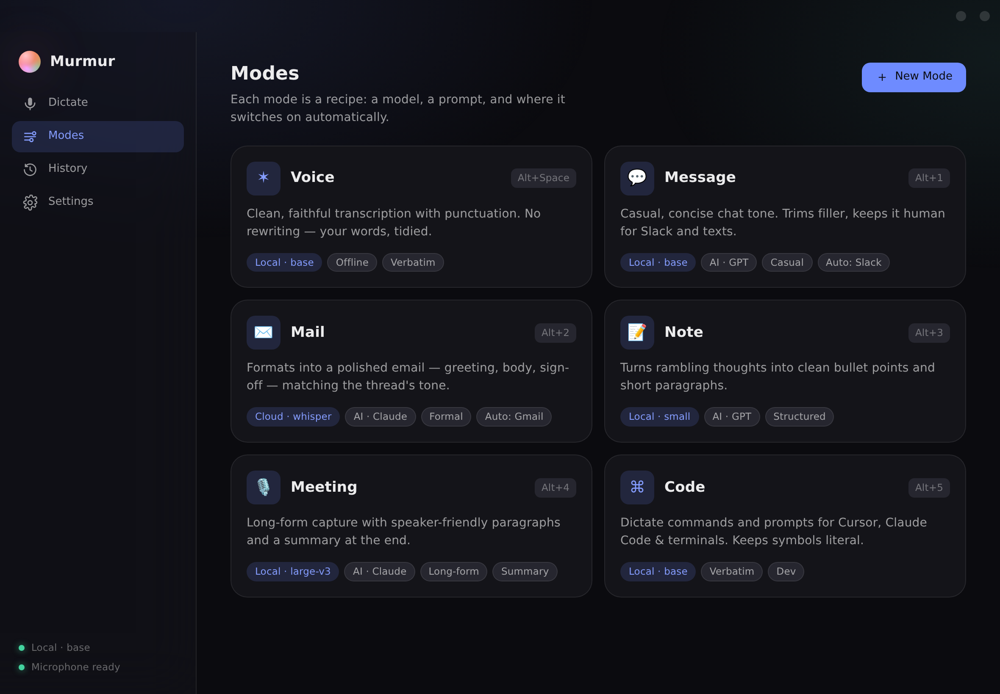
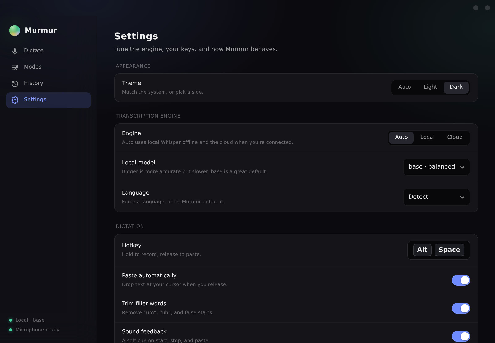

# Murmur

**Talk. It types.**

Murmur is a private voice‑dictation app for Windows. Hold a hotkey, speak, and
let go — your words are transcribed (offline or in the cloud), optionally
polished by AI into the right tone, and dropped straight where your cursor is.
It works in any app: email, Slack, your browser, your code editor.

It's an original, from‑scratch take on the idea behind apps like *superwhisper*,
built on the open‑source [Whisper](https://github.com/openai/whisper) speech
model and given a calm, Apple‑inspired interface — with a signature **aurora
orb** that breathes and reacts to your voice.



---

## What it does

| | |
|---|---|
| 🎤 **Hold‑to‑talk, anywhere** | Press and hold `Alt + Space` in any app, speak, release. |
| ✍️ **Voice → text** | Whisper transcription with automatic punctuation. |
| 🔒 **Offline or cloud** | Local Whisper when you're offline; cloud API when you're online. Auto‑switches. |
| 🤖 **Modes** | Each mode is a recipe — a model, a prompt, and rules. Turn rambling into a clean email, a Slack message, bullet‑point notes… |
| 🪄 **Auto‑switch modes** | Murmur picks the right mode based on the app you're in (Gmail → Mail, Slack → Message). |
| 📋 **Paste anywhere** | The finished text lands at your cursor automatically. |
| 🕘 **History** | Every dictation, searchable and private to your device. |
| 🌗 **Light / Dark / Auto** | A polished theme that follows your system. |



---

## Install (Windows)

1. Install **Python 3.10+** from [python.org](https://www.python.org/downloads/) —
   tick *“Add python.exe to PATH”* during setup.
2. Download this `murmur` folder.
3. Double‑click **`install.bat`** (one time — it creates a local environment and
   installs everything).
4. Double‑click **`run.bat`** to launch.

That's it. Murmur opens its window and starts listening for the hotkey in the
background.

> **WebView2 runtime:** Murmur draws its UI with Microsoft’s WebView2, which is
> already on most Windows 10/11 PCs. If the window doesn’t appear, install it
> from [here](https://developer.microsoft.com/microsoft-edge/webview2/).

---

## How it works

```
  Hold hotkey ─▶ 🎤 record ─▶ ✍️ transcribe ─▶ 🤖 rewrite (mode) ─▶ 📋 paste
                 (mic)        (Whisper:           (optional LLM)     (at cursor)
                              local or cloud)
```

1. **Record** — your microphone is captured while you hold the key. The orb
   reacts to your voice in real time.
2. **Transcribe** — audio becomes text. *Local* uses
   [`faster‑whisper`](https://github.com/SYSTRAN/faster-whisper) on your machine
   (private, no internet). *Cloud* uses an API for speed/accuracy when online.
   **Auto** prefers local and falls back to cloud.
3. **Polish (optional)** — if the active **mode** has an AI prompt, the
   transcript is rewritten (e.g. into a formatted email). If the LLM ever fails,
   you still get your verbatim text — your words are never lost.
4. **Paste** — the result is placed at your cursor.



### Modes

A mode bundles a **transcription model**, an optional **AI prompt**, **context**
it’s allowed to read (active app, selected text, clipboard), and
**auto‑activation** rules. Built‑in modes: **Voice, Message, Mail, Note,
Meeting, Code** — all editable, and you can add your own (e.g. “format as a JIRA
ticket”).

### Offline & online

- **Offline?** Local Whisper handles everything on‑device. Private and free.
- **Online?** Set an engine or mode to *Cloud* for the fastest, most accurate
  results, and add your API key in **Settings**.
- **Auto** does the right thing automatically.

---

## Privacy

- Local mode never sends audio anywhere — it stays on your computer.
- History is a local SQLite file on your device.
- API keys are stored locally and only used when a **cloud** mode runs. The UI
  never displays your keys back to you in full.

Your data lives in:

```
Windows : %APPDATA%\Murmur
macOS   : ~/Library/Application Support/Murmur
Linux   : ~/.config/murmur
```

---

## Project layout

```
murmur/
├─ murmur/                 # the Python package
│  ├─ __main__.py          # entry point — creates the windows
│  ├─ app.py               # controller (pipeline) + UI bridge (Api)
│  ├─ config.py            # settings (validated, persisted)
│  ├─ modes.py             # Mode model, defaults, prompt building
│  ├─ history.py           # SQLite dictation history + stats
│  ├─ audio.py             # microphone capture + live levels
│  ├─ hotkeys.py           # global hold‑to‑talk state machine
│  ├─ paste.py             # clipboard + paste‑anywhere
│  ├─ context.py           # active‑app detection (auto modes)
│  ├─ transcribe/          # local Whisper + cloud + engine selection
│  ├─ rewrite/             # LLM rewriting (OpenAI / Anthropic)
│  └─ ui/                  # the interface (HTML/CSS/JS)
│     ├─ shared/tokens.css # design system
│     ├─ main/             # main window
│     └─ pill/             # floating orb overlay
├─ tests/                  # unit tests for all the pure logic
├─ tools/render_ui.py      # dev: screenshot the UI
├─ requirements.txt
├─ install.bat  /  run.bat
└─ README.md
```

The UI is plain HTML/CSS/JS so it stays fast and easy to tweak. It talks to
Python through a small bridge, and falls back to sample data when opened in a
normal browser — handy for design work.

---

## Develop

```bash
# run the tests (no native deps needed)
python -m pytest

# preview the UI in a browser
open murmur/ui/main/index.html         # or just double-click it

# regenerate the screenshots in this README
pip install playwright && python -m playwright install chromium
python tools/render_ui.py assets
```

---

## Status & roadmap

This is **v0.1** — the core loop, modes, history, settings, and the full UI are
in place. On the list next: an in‑app mode editor, custom vocabulary &
replacement rules, a menu‑bar/tray presence, model‑download progress, and a
meeting recorder. Ideas welcome.

---

*Built as an original project inspired by the dictation‑app category. Whisper is
© OpenAI under the MIT license; Murmur’s code and design are its own.*
